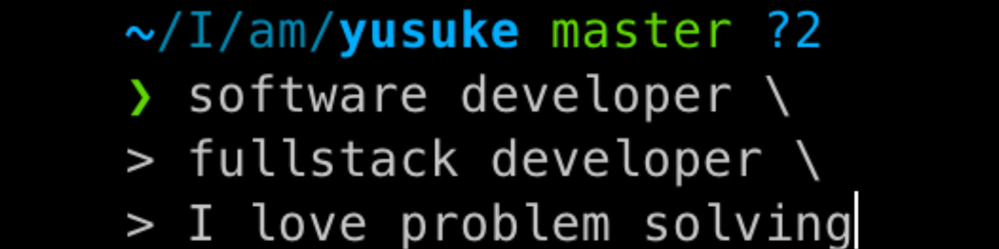

- 🌱 I’m currently learning ** Go, AWS and Blockchain**
- 👨‍💻 All of my projects are available at [here](https://yk-jp-portfolio.vercel.app/)
- 📄 Please take a look at my [resume](https://github.com/yk-jp/portfolio-v2/blob/main/public/resume.pdf)
- 📫 How to reach me **k82.y12@gmail.com**

<h3 align="left">Connect with me</h3>

<h3 align="left">Holopin badges</h3>

<h3 align="left">Languages and Tools:</h3>

                                

<h3 align="left">GitHub Stats</h3>

